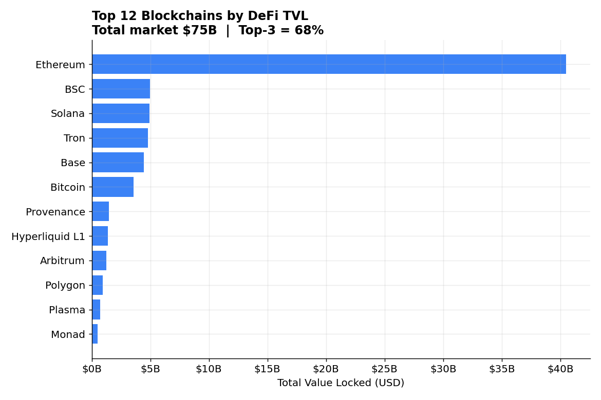

# On-Chain DeFi & Stablecoin Analytics

A live analytics dashboard over the DeFi and stablecoin markets, built from public
on-chain data. It pairs standard market-structure charts with a **rolling mean ± kσ
anomaly-detection layer** that flags abnormal daily moves in aggregate supply and TVL.

**Live dashboard:** https://onchain-defi-intel.streamlit.app  ·  **Code:** https://github.com/qjian33/onchain-defi-dashboard



---

## Why this project

On-chain aggregates (stablecoin supply, chain TVL) move slowly most of the time and
then jump on liquidations, de-pegs, mint/burn events, or capital rotation. Those jumps
are the interesting part. This dashboard surfaces them automatically instead of relying
on eyeballing a line chart.

The anomaly method is the same one I used in a quant-research automation project:
compare each day's change against a trailing rolling mean and flag anything beyond
*k* standard deviations. Simple, transparent, and hard to argue with — which is what
you want in a monitoring signal.

## What it shows

| Section | Question it answers |
|---|---|
| Headline metrics | Total DeFi TVL, top-3 chain concentration, stablecoin supply, market HHI |
| TVL by chain | Which chains dominate DeFi, and how concentrated is the market? |
| Stablecoin share | Who controls the stablecoin market? |
| **Anomaly detection** | Which specific days saw abnormal supply moves — spikes vs. drops? |

## Key findings (as of the latest run)

- **DeFi TVL is highly concentrated.** ~$75B total across 450+ chains, but the top 3
  chains hold ~68% of it (HHI ≈ 0.32 — a concentrated market by antitrust standards).
- **Ethereum still anchors DeFi**, holding more TVL than the next several chains combined.
- **Stablecoins are a $310B market**, with USDT alone at ~59% dominance — a single point
  of systemic concentration worth monitoring.
- **The anomaly layer flags ~180 abnormal days** over the full history, clustering around
  known stress events (de-pegs, large redemptions) — evidence the signal tracks real events
  rather than noise.

## Method — anomaly detection

For a daily series *x*:

```
change_t   = x_t - x_(t-1)
rolling_mean_t, rolling_std_t = mean/std of change over trailing `window` days
z_t        = (change_t - rolling_mean_t) / rolling_std_t
anomaly    = |z_t| > k        # default window = 30 days, k = 2.0
```

Both `window` and `k` are interactive in the dashboard so a reviewer can see how the
signal tightens or loosens.

## Tech stack

`Python` · `pandas` · `matplotlib` · `Streamlit` · DefiLlama public API

## Run locally

```bash
pip install -r requirements.txt
python defi_chain_analysis.py     # CLI: prints findings, writes charts + CSVs
streamlit run dashboard.py        # interactive dashboard at http://localhost:8501
```

## Deploy the dashboard for free (public link for your portfolio)

1. Push this folder to a **public GitHub repo**.
2. Go to **share.streamlit.io**, sign in with GitHub, click *New app*.
3. Point it at `dashboard.py` on the `main` branch → *Deploy*.
4. You get a public `https://<name>.streamlit.app` URL — put it in your résumé.

## Data source

All data from the [DefiLlama public API](https://defillama.com/docs/api) — no API key,
no rate-limit signup, reachable without a proxy.

---

_Built by Qingqing Jian — data analyst (healthcare data + LLM automation background)._
